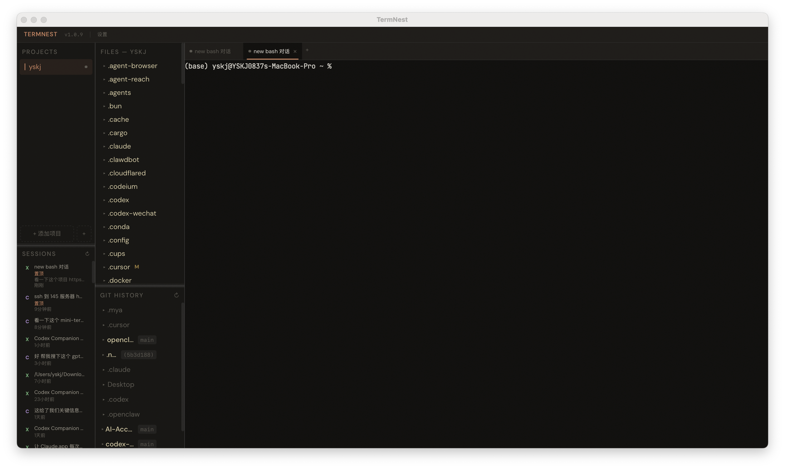
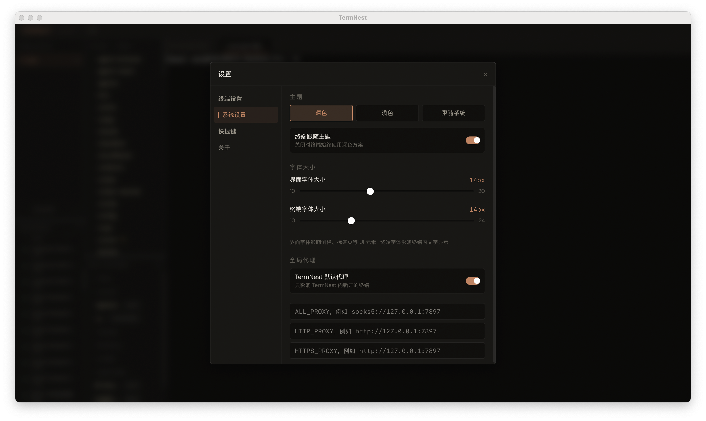

<p align="center">
  
</p>

<h1 align="center">TermNest</h1>

<p align="center">
  <strong>AI-native desktop workspace for terminal-first developers</strong>
</p>

<p align="center">
  <a href="https://github.com/flowxai/termnest/releases"></a>
  
  
  
</p>

---

One window. Multiple projects. All your Claude / Codex sessions. Split terminals. A file editor. Git diffs. No Electron.



## Why

When you're deep in an AI coding workflow, you don't need a full IDE — you need a **cockpit**:

- Terminals that stay alive across sessions
- One-click resume for Claude Code and Codex conversations
- Split panes so you can watch an agent work while running tests
- A file editor for quick fixes without leaving the window
- Git status at a glance

TermNest puts all of this in a single, fast, native window built on Tauri v2 + Rust.

## Features

**Multi-project workspace** — Switch between repos instantly. Each project keeps its own tabs, splits, and session history.

**Terminal-first** — Tabbed terminals with recursive split panes, WebGL-accelerated rendering (xterm.js v6), and zero-latency PTY I/O.

**AI session management** — Auto-discovers local Claude Code and Codex sessions. Resume any conversation with one click. Pin, rename, or delete sessions per-project.

**Lightweight editor** — Open files from the tree, edit across tabs, `Cmd+S` to save. Dirty state tracking and external modification detection. Fills the workspace when no terminal is open; coexists when one is.

**Git integration** — File tree shows working-tree status. View diffs, commit history, and per-commit file changes without leaving the app.

**Proxy-aware** — Global proxy defaults with per-project overrides. Only affects terminals inside TermNest — never touches your system Terminal or iTerm.



## Architecture

```
┌─────────────────────────────────────────────────────────┐
│ Tauri v2 (Rust)                                         │
│  ├─ pty.rs        PTY lifecycle, zero-latency I/O       │
│  ├─ ai_sessions   Claude/Codex session discovery        │
│  ├─ process_monitor  AI process state detection         │
│  ├─ fs.rs         Directory listing + file watcher      │
│  ├─ git.rs        libgit2 bindings                      │
│  └─ config.rs     Persistent config + proxy resolution  │
├─────────────────────────────────────────────────────────┤
│ React 19 + TypeScript                                   │
│  ├─ Zustand       Single global store                   │
│  ├─ xterm.js v6   WebGL-rendered terminal instances     │
│  ├─ Allotment     Resizable three-column layout         │
│  └─ SplitNode     Recursive binary split tree           │
├─────────────────────────────────────────────────────────┤
│ Data flow                                               │
│  keypress → xterm → write_pty → PTY                     │
│  PTY output → immediate flush → pty-output → xterm      │
│  process monitor → pty-status-change → status dots      │
│  file watcher → fs-change → file tree refresh           │
└─────────────────────────────────────────────────────────┘
```

## Quick Start

### Download

Grab the latest build from [Releases](https://github.com/flowxai/termnest/releases).

### Build from source

```bash
# Prerequisites: Node.js >= 18, Rust >= 1.70, Tauri v2 CLI
git clone https://github.com/flowxai/termnest.git
cd termnest
npm install
npm run tauri dev      # development
npm run tauri build    # production bundle
```

## Tech Stack

| Layer | Tech |
|-------|------|
| Shell | Tauri v2 + Rust |
| Frontend | React 19, TypeScript, Zustand, Tailwind CSS v4, Vite |
| Terminal | xterm.js v6 + WebGL addon, portable-pty |
| Git | libgit2 (git2-rs) |
| File watch | notify + ignore |
| Layout | Allotment + recursive SplitNode tree |

## Non-goals

TermNest is not trying to be a full IDE, a complete Git client, or a Monaco-powered code editor. It's a **workspace** — the place where you manage your AI agents, terminals, and projects in one view.

## License

MIT
